# 資料庫 Schema 設計書 — Atlas Trading System v5.0

> 文件版本：1.0 | 日期：2026-07-01 | 作者：SD（系統設計師）| 審核：PM

---

## 1. ER Diagram

```mermaid
erDiagram
    market ||--o{ stock : "contains"
    market ||--o{ industry : "has"
    market ||--o{ market_regime : "evaluated_in"
    market ||--o{ industry_rs : "measured_in"

    stock ||--o{ daily_price : "has"
    stock ||--o{ intraday_tick : "has"
    stock ||--o{ institutional_flow : "tracked"
    stock ||--o{ margin_trading : "tracked"
    stock ||--o{ revenue : "reported"
    stock ||--o{ scan_result : "scanned"
    stock ||--o{ signal : "generates"
    stock ||--o{ conclusion : "evaluated"
    stock ||--o{ detector_alert : "triggered"
    stock ||--o{ backtest_trade : "simulated"
    stock ||--o{ trade_journal : "traded"

    industry ||--o{ stock : "categorizes"
    industry ||--o{ industry_rs : "measured"

    strategy ||--o{ scan_result : "produces"
    strategy ||--o{ signal : "generates"
    strategy ||--o{ backtest_run : "tested_by"

    backtest_run ||--o{ backtest_trade : "contains"
    backtest_run ||--o{ monte_carlo_result : "simulated"
    backtest_run ||--o{ walk_forward_result : "validated"

    user_account ||--o{ watchlist : "owns"
    user_account ||--o{ trade_journal : "records"
    user_account ||--o{ audit_log : "audited"
    user_account ||--o{ notification_log : "receives"

    market {
        smallint market_id PK
        varchar code UK
        varchar name
        varchar timezone
        varchar currency
        boolean is_active
    }

    stock {
        serial stock_id PK
        smallint market_id FK
        varchar symbol UK
        varchar name
        integer industry_id FK
        varchar listing_type
        date listing_date
        boolean is_active
    }

    daily_price {
        bigserial price_id PK
        integer stock_id FK
        date trade_date
        numeric open
        numeric high
        numeric low
        numeric close
        bigint volume
        numeric adj_close
    }

    intraday_tick {
        bigserial tick_id PK
        integer stock_id FK
        timestamp tick_time
        numeric price
        bigint volume
        numeric bid
        numeric ask
    }

    institutional_flow {
        bigserial flow_id PK
        integer stock_id FK
        date trade_date
        bigint foreign_buy_sell
        bigint trust_buy_sell
        bigint dealer_buy_sell
        bigint total_buy_sell
    }

    margin_trading {
        bigserial margin_id PK
        integer stock_id FK
        date trade_date
        bigint margin_balance
        bigint margin_change
        bigint short_balance
        bigint short_change
        numeric short_ratio
    }

    revenue {
        bigserial revenue_id PK
        integer stock_id FK
        smallint year
        smallint month
        bigint revenue_amount
        numeric mom_pct
        numeric yoy_pct
    }

    industry {
        serial industry_id PK
        smallint market_id FK
        varchar code UK
        varchar name
        varchar sector
    }

    industry_rs {
        bigserial rs_id PK
        integer industry_id FK
        date calc_date
        numeric rs_5d
        numeric rs_20d
        numeric rs_60d
        varchar trend
    }

    strategy {
        serial strategy_id PK
        varchar code UK
        varchar name
        varchar category
        jsonb default_params
        boolean is_active
    }

    scan_result {
        bigserial scan_id PK
        integer stock_id FK
        integer strategy_id FK
        date scan_date
        numeric axis_score
        jsonb aspect_result
        varchar verdict
    }

    signal {
        bigserial signal_id PK
        integer stock_id FK
        integer strategy_id FK
        timestamp signal_time
        varchar direction
        numeric confidence
        jsonb detail
    }

    conclusion {
        bigserial conclusion_id PK
        integer stock_id FK
        date eval_date
        smallint raw_level
        smallint adjusted_level
        jsonb downgrade_reasons
    }

    market_regime {
        bigserial regime_id PK
        smallint market_id FK
        date eval_date
        varchar regime
        varchar sentiment
        numeric sentiment_score
        jsonb breadth
    }

    detector_alert {
        bigserial alert_id PK
        integer stock_id FK
        varchar detector_type
        timestamp alert_time
        varchar severity
        jsonb detail
    }

    backtest_run {
        uuid run_id PK
        integer strategy_id FK
        jsonb parameters
        date start_date
        date end_date
        jsonb metrics
        varchar status
    }

    backtest_trade {
        bigserial trade_id PK
        uuid run_id FK
        integer stock_id FK
        varchar side
        date entry_date
        date exit_date
        numeric entry_price
        numeric exit_price
        numeric pnl_pct
        numeric r_multiple
    }

    monte_carlo_result {
        bigserial mc_id PK
        uuid run_id FK
        integer num_paths
        jsonb percentiles
        numeric median_max_dd
    }

    walk_forward_result {
        bigserial wf_id PK
        uuid run_id FK
        smallint window_index
        date is_start
        date is_end
        date oos_start
        date oos_end
        jsonb is_metrics
        jsonb oos_metrics
    }

    user_account {
        serial user_id PK
        varchar username UK
        varchar email UK
        varchar password_hash
        varchar totp_secret
        boolean is_active
        smallint failed_attempts
        timestamp locked_until
    }

    watchlist {
        bigserial watchlist_id PK
        integer user_id FK
        varchar tab_name
        integer stock_id FK
        smallint sort_order
    }

    trade_journal {
        bigserial journal_id PK
        integer user_id FK
        integer stock_id FK
        varchar side
        date entry_date
        date exit_date
        numeric entry_price
        numeric exit_price
        integer shares
        numeric r_value
        numeric r_multiple
        text notes
    }

    notification_log {
        bigserial notif_id PK
        integer user_id FK
        varchar channel
        varchar event_type
        varchar status
        timestamp sent_at
        text message_body
    }

    audit_log {
        bigserial audit_id PK
        integer user_id FK
        varchar action
        varchar resource
        jsonb detail
        inet source_ip
        timestamp action_at
    }

    system_health {
        bigserial health_id PK
        varchar component
        varchar status
        numeric latency_ms
        jsonb detail
        timestamp checked_at
    }

    data_source_status {
        bigserial ds_id PK
        varchar source_name
        varchar status
        timestamp last_success
        timestamp last_failure
        text last_error
    }

    schedule_execution {
        bigserial exec_id PK
        varchar task_name
        varchar status
        timestamp started_at
        timestamp finished_at
        text error_message
    }
```



---

## 2. 完整 DDL (PostgreSQL)

### 2.1 自訂型別 (ENUM Types)

```sql
-- =============================================================
-- Atlas Trading System v5.0 — Database Schema DDL
-- 建立順序：ENUM → 基礎表 → 業務表 → 分割表
-- =============================================================

-- ---- ENUM Types ----

CREATE TYPE market_code AS ENUM ('TW', 'US');
CREATE TYPE listing_type AS ENUM ('TWSE', 'TPEx', 'NYSE', 'NASDAQ');
CREATE TYPE regime_state AS ENUM ('BULL', 'RANGE', 'BEAR');
CREATE TYPE sentiment_state AS ENUM ('GREED', 'NEUTRAL', 'FEAR');
CREATE TYPE trend_state AS ENUM ('RISING', 'FALLING', 'FLAT');
CREATE TYPE signal_direction AS ENUM ('BUY', 'SELL', 'HOLD');
CREATE TYPE trade_side AS ENUM ('LONG', 'SHORT');
CREATE TYPE scan_verdict AS ENUM ('INCLUDE', 'EXCLUDE');
CREATE TYPE conclusion_level AS ENUM ('Lv5', 'Lv4', 'Lv3', 'Lv2', 'Lv1', 'Lv0', 'Lv-1', 'Lv-2');
CREATE TYPE detector_type AS ENUM (
    'INDUSTRY_SURGE', 'LARGE_ORDER', 'VOLUME_SPIKE', 'LAUNCH_TRIGGER',
    'MA_BREAK', 'SHAKEOUT_RECOVERY', 'DISTRIBUTION_WARN', 'PV_DIVERGENCE',
    'SHARP_MOVE', 'LIQUIDITY_SWEEP', 'OB_RETEST'
);
CREATE TYPE intraday_signal_type AS ENUM ('B1', 'B2', 'B3', 'S1', 'S2', 'S3');
CREATE TYPE severity_level AS ENUM ('INFO', 'WARNING', 'CRITICAL');
CREATE TYPE confidence_level AS ENUM ('HIGH', 'MEDIUM', 'LOW');
CREATE TYPE strategy_category AS ENUM (
    'O_SERIES', 'S_SERIES', 'K_SERIES', 'P_SERIES',
    'T_SERIES', 'SD_SERIES', 'SMC', 'ML', 'MODULE'
);
CREATE TYPE notification_channel AS ENUM ('DISCORD', 'LINE', 'TELEGRAM', 'EMAIL');
CREATE TYPE notification_status AS ENUM ('SENT', 'FAILED', 'SKIPPED');
CREATE TYPE task_status AS ENUM ('PENDING', 'RUNNING', 'SUCCESS', 'FAILED', 'SKIPPED');
CREATE TYPE backtest_status AS ENUM ('PENDING', 'RUNNING', 'COMPLETED', 'FAILED');
CREATE TYPE health_status AS ENUM ('HEALTHY', 'DEGRADED', 'UNHEALTHY');
CREATE TYPE source_status AS ENUM ('HEALTHY', 'UNHEALTHY', 'RATE_LIMITED', 'UNKNOWN');
CREATE TYPE audit_action AS ENUM (
    'LOGIN', 'LOGOUT', 'LOGIN_FAILED',
    'STRATEGY_PARAM_CHANGE', 'RISK_PARAM_CHANGE', 'CONFIG_CHANGE',
    'BACKTEST_EXECUTE', 'SCAN_EXPORT', 'SCHEDULE_TOGGLE',
    'WATCHLIST_CHANGE', 'TRADE_ENTRY', 'TRADE_EXIT'
);
```

### 2.2 基礎表 — 市場與股票

```sql
-- ---- market (市場定義) ----
CREATE TABLE market (
    market_id   SMALLSERIAL PRIMARY KEY,
    code        market_code    NOT NULL UNIQUE,
    name        VARCHAR(50)    NOT NULL,
    timezone    VARCHAR(40)    NOT NULL DEFAULT 'Asia/Taipei',
    currency    VARCHAR(10)    NOT NULL DEFAULT 'TWD',
    open_time   TIME           NOT NULL DEFAULT '09:00',
    close_time  TIME           NOT NULL DEFAULT '13:30',
    is_active   BOOLEAN        NOT NULL DEFAULT TRUE,
    created_at  TIMESTAMPTZ    NOT NULL DEFAULT NOW(),
    updated_at  TIMESTAMPTZ    NOT NULL DEFAULT NOW()
);

COMMENT ON TABLE market IS '市場定義（台股/美股）';

-- ---- industry (產業分類) ----
CREATE TABLE industry (
    industry_id SERIAL PRIMARY KEY,
    market_id   SMALLINT       NOT NULL REFERENCES market(market_id),
    code        VARCHAR(20)    NOT NULL,
    name        VARCHAR(100)   NOT NULL,
    sector      VARCHAR(100),
    is_active   BOOLEAN        NOT NULL DEFAULT TRUE,
    created_at  TIMESTAMPTZ    NOT NULL DEFAULT NOW(),
    updated_at  TIMESTAMPTZ    NOT NULL DEFAULT NOW(),
    UNIQUE (market_id, code)
);

COMMENT ON TABLE industry IS '產業分類（TWSE ≥28 產業）';

-- ---- stock (股票主檔) ----
CREATE TABLE stock (
    stock_id      SERIAL PRIMARY KEY,
    market_id     SMALLINT       NOT NULL REFERENCES market(market_id),
    symbol        VARCHAR(20)    NOT NULL,
    name          VARCHAR(100)   NOT NULL,
    industry_id   INTEGER        REFERENCES industry(industry_id),
    listing_type  listing_type   NOT NULL,
    listing_date  DATE,
    market_cap    BIGINT,
    is_disposal   BOOLEAN        NOT NULL DEFAULT FALSE,   -- 處置股
    is_alert      BOOLEAN        NOT NULL DEFAULT FALSE,   -- 警示股
    is_full_cash  BOOLEAN        NOT NULL DEFAULT FALSE,   -- 全額交割
    is_active     BOOLEAN        NOT NULL DEFAULT TRUE,
    created_at    TIMESTAMPTZ    NOT NULL DEFAULT NOW(),
    updated_at    TIMESTAMPTZ    NOT NULL DEFAULT NOW(),
    UNIQUE (market_id, symbol)
);

COMMENT ON TABLE stock IS '股票主檔（台股 ~2000 筆、美股待擴充）';

CREATE INDEX idx_stock_market ON stock(market_id);
CREATE INDEX idx_stock_industry ON stock(industry_id);
CREATE INDEX idx_stock_active ON stock(market_id, is_active) WHERE is_active = TRUE;
```

### 2.3 市場資料群組

```sql
-- ---- daily_price (日K線) — Range Partition by year ----
CREATE TABLE daily_price (
    price_id    BIGSERIAL,
    stock_id    INTEGER        NOT NULL,
    trade_date  DATE           NOT NULL,
    open        NUMERIC(12,4)  NOT NULL,
    high        NUMERIC(12,4)  NOT NULL,
    low         NUMERIC(12,4)  NOT NULL,
    close       NUMERIC(12,4)  NOT NULL,
    volume      BIGINT         NOT NULL DEFAULT 0,
    adj_close   NUMERIC(12,4),
    turnover    BIGINT,                              -- 成交金額（千元）
    trade_count INTEGER,                             -- 成交筆數
    created_at  TIMESTAMPTZ    NOT NULL DEFAULT NOW(),
    PRIMARY KEY (trade_date, stock_id),
    CHECK (high >= low),
    CHECK (high >= open AND high >= close),
    CHECK (low <= open AND low <= close),
    CHECK (volume >= 0)
) PARTITION BY RANGE (trade_date);

COMMENT ON TABLE daily_price IS '日K線 OHLCV — Range Partition by year';

CREATE INDEX idx_daily_stock_date ON daily_price(stock_id, trade_date);
CREATE INDEX idx_daily_date ON daily_price(trade_date);

-- ---- intraday_tick (盤中 Tick) — Range Partition by day ----
CREATE TABLE intraday_tick (
    tick_id     BIGSERIAL,
    stock_id    INTEGER        NOT NULL,
    tick_time   TIMESTAMPTZ    NOT NULL,
    price       NUMERIC(12,4)  NOT NULL,
    volume      BIGINT         NOT NULL DEFAULT 0,
    bid_price   NUMERIC(12,4),
    ask_price   NUMERIC(12,4),
    bid_volume  BIGINT,
    ask_volume  BIGINT,
    tick_type   CHAR(1),                             -- 'T' trade, 'Q' quote
    created_at  TIMESTAMPTZ    NOT NULL DEFAULT NOW(),
    PRIMARY KEY (tick_time, stock_id),
    CHECK (price > 0),
    CHECK (volume >= 0)
) PARTITION BY RANGE (tick_time);

COMMENT ON TABLE intraday_tick IS '盤中 Tick 資料 — Range Partition by day, 保留 90 天';

CREATE INDEX idx_tick_stock_time ON intraday_tick(stock_id, tick_time);

-- ---- institutional_flow (三大法人買賣超) ----
CREATE TABLE institutional_flow (
    flow_id          BIGSERIAL PRIMARY KEY,
    stock_id         INTEGER        NOT NULL REFERENCES stock(stock_id),
    trade_date       DATE           NOT NULL,
    foreign_buy      BIGINT         NOT NULL DEFAULT 0,
    foreign_sell     BIGINT         NOT NULL DEFAULT 0,
    foreign_net      BIGINT         NOT NULL DEFAULT 0,   -- 外資淨買賣
    trust_buy        BIGINT         NOT NULL DEFAULT 0,
    trust_sell       BIGINT         NOT NULL DEFAULT 0,
    trust_net        BIGINT         NOT NULL DEFAULT 0,   -- 投信淨買賣
    dealer_buy       BIGINT         NOT NULL DEFAULT 0,
    dealer_sell      BIGINT         NOT NULL DEFAULT 0,
    dealer_net       BIGINT         NOT NULL DEFAULT 0,   -- 自營商淨買賣
    total_net        BIGINT         NOT NULL DEFAULT 0,   -- 三大法人合計淨買賣
    created_at       TIMESTAMPTZ    NOT NULL DEFAULT NOW(),
    UNIQUE (stock_id, trade_date)
);

COMMENT ON TABLE institutional_flow IS '三大法人每日個股買賣超';

CREATE INDEX idx_flow_date ON institutional_flow(trade_date);
CREATE INDEX idx_flow_stock_date ON institutional_flow(stock_id, trade_date);

-- ---- margin_trading (融資融券) ----
CREATE TABLE margin_trading (
    margin_id       BIGSERIAL PRIMARY KEY,
    stock_id        INTEGER        NOT NULL REFERENCES stock(stock_id),
    trade_date      DATE           NOT NULL,
    margin_buy      BIGINT         NOT NULL DEFAULT 0,    -- 融資買進
    margin_sell     BIGINT         NOT NULL DEFAULT 0,    -- 融資賣出
    margin_balance  BIGINT         NOT NULL DEFAULT 0,    -- 融資餘額（張）
    margin_change   BIGINT         NOT NULL DEFAULT 0,    -- 融資增減
    short_buy       BIGINT         NOT NULL DEFAULT 0,    -- 融券買進
    short_sell      BIGINT         NOT NULL DEFAULT 0,    -- 融券賣出
    short_balance   BIGINT         NOT NULL DEFAULT 0,    -- 融券餘額（張）
    short_change    BIGINT         NOT NULL DEFAULT 0,    -- 融券增減
    short_ratio     NUMERIC(8,4)   NOT NULL DEFAULT 0,    -- 券資比 (%)
    created_at      TIMESTAMPTZ    NOT NULL DEFAULT NOW(),
    UNIQUE (stock_id, trade_date)
);

COMMENT ON TABLE margin_trading IS '融資融券每日餘額與增減';

CREATE INDEX idx_margin_date ON margin_trading(trade_date);
CREATE INDEX idx_margin_stock_date ON margin_trading(stock_id, trade_date);

-- ---- revenue (月營收) ----
CREATE TABLE revenue (
    revenue_id      BIGSERIAL PRIMARY KEY,
    stock_id        INTEGER        NOT NULL REFERENCES stock(stock_id),
    report_year     SMALLINT       NOT NULL,
    report_month    SMALLINT       NOT NULL CHECK (report_month BETWEEN 1 AND 12),
    revenue_amount  BIGINT         NOT NULL,              -- 營收（千元）
    mom_pct         NUMERIC(8,4),                         -- 月增率 (%)
    yoy_pct         NUMERIC(8,4),                         -- 年增率 (%)
    cumulative_yoy  NUMERIC(8,4),                         -- 累計年增率 (%)
    created_at      TIMESTAMPTZ    NOT NULL DEFAULT NOW(),
    UNIQUE (stock_id, report_year, report_month)
);

COMMENT ON TABLE revenue IS '月營收資料（含年增率/月增率）';

CREATE INDEX idx_revenue_stock ON revenue(stock_id);
CREATE INDEX idx_revenue_period ON revenue(report_year, report_month);
```

### 2.4 產業分析群組

```sql
-- ---- industry_rs (產業相對強度) ----
CREATE TABLE industry_rs (
    rs_id           BIGSERIAL PRIMARY KEY,
    industry_id     INTEGER        NOT NULL REFERENCES industry(industry_id),
    calc_date       DATE           NOT NULL,
    rs_5d           NUMERIC(10,4),                     -- 5 日 RS 值
    rs_20d          NUMERIC(10,4),                     -- 20 日 RS 值
    rs_60d          NUMERIC(10,4),                     -- 60 日 RS 值
    rank_5d         SMALLINT,                          -- 5 日排名
    rank_20d        SMALLINT,                          -- 20 日排名
    rank_60d        SMALLINT,                          -- 60 日排名
    trend           trend_state    NOT NULL DEFAULT 'FLAT',
    fund_flow_net   BIGINT         DEFAULT 0,          -- 產業族群資金淨流入
    created_at      TIMESTAMPTZ    NOT NULL DEFAULT NOW(),
    UNIQUE (industry_id, calc_date)
);

COMMENT ON TABLE industry_rs IS '產業相對強度（多週期 RS + 排名 + 趨勢）';

CREATE INDEX idx_irs_date ON industry_rs(calc_date);
CREATE INDEX idx_irs_industry_date ON industry_rs(industry_id, calc_date);
```

### 2.5 策略與訊號群組

```sql
-- ---- strategy (策略定義) ----
CREATE TABLE strategy (
    strategy_id     SERIAL PRIMARY KEY,
    code            VARCHAR(30)    NOT NULL UNIQUE,
    name            VARCHAR(100)   NOT NULL,
    category        strategy_category NOT NULL,
    description     TEXT,
    default_params  JSONB          NOT NULL DEFAULT '{}',
    is_active       BOOLEAN        NOT NULL DEFAULT TRUE,
    sort_order      SMALLINT       NOT NULL DEFAULT 0,
    created_at      TIMESTAMPTZ    NOT NULL DEFAULT NOW(),
    updated_at      TIMESTAMPTZ    NOT NULL DEFAULT NOW()
);

COMMENT ON TABLE strategy IS '策略定義（22 日K策略 + 20 模組 + SMC + ML）';

CREATE INDEX idx_strategy_category ON strategy(category);
CREATE INDEX idx_strategy_active ON strategy(is_active) WHERE is_active = TRUE;

-- ---- scan_result (掃描結果) ----
CREATE TABLE scan_result (
    scan_id         BIGSERIAL PRIMARY KEY,
    stock_id        INTEGER        NOT NULL REFERENCES stock(stock_id),
    strategy_id     INTEGER        REFERENCES strategy(strategy_id),
    scan_date       DATE           NOT NULL,
    -- 四大主軸分數
    axis_industry   NUMERIC(6,2)   CHECK (axis_industry BETWEEN 0 AND 100),
    axis_catalyst   NUMERIC(6,2)   CHECK (axis_catalyst BETWEEN 0 AND 100),
    axis_fund_flow  NUMERIC(6,2)   CHECK (axis_fund_flow BETWEEN 0 AND 100),
    axis_rs         NUMERIC(6,2)   CHECK (axis_rs BETWEEN 0 AND 100),
    axis_total      NUMERIC(6,2)   CHECK (axis_total BETWEEN 0 AND 100),
    -- 三大面向判定
    tech_verdict    VARCHAR(10)    CHECK (tech_verdict IN ('POSITIVE', 'NEUTRAL', 'NEGATIVE')),
    fund_verdict    VARCHAR(10)    CHECK (fund_verdict IN ('POSITIVE', 'NEUTRAL', 'NEGATIVE')),
    chip_verdict    VARCHAR(10)    CHECK (chip_verdict IN ('POSITIVE', 'NEUTRAL', 'NEGATIVE')),
    positive_count  SMALLINT       CHECK (positive_count BETWEEN 0 AND 3),
    -- 輔助確認
    aux_confidence  confidence_level,
    aux_detail      JSONB,                             -- 七流派/ML/SMC 明細
    -- 最終裁定
    verdict         scan_verdict   NOT NULL,
    exclude_reason  TEXT,
    created_at      TIMESTAMPTZ    NOT NULL DEFAULT NOW()
);

COMMENT ON TABLE scan_result IS '每日選股掃描結果（四主軸 + 三面向 + 輔助確認）';

CREATE INDEX idx_scan_date ON scan_result(scan_date);
CREATE INDEX idx_scan_stock_date ON scan_result(stock_id, scan_date);
CREATE INDEX idx_scan_verdict ON scan_result(scan_date, verdict) WHERE verdict = 'INCLUDE';

-- ---- signal (訊號) ----
CREATE TABLE signal (
    signal_id       BIGSERIAL PRIMARY KEY,
    stock_id        INTEGER        NOT NULL REFERENCES stock(stock_id),
    strategy_id     INTEGER        REFERENCES strategy(strategy_id),
    signal_time     TIMESTAMPTZ    NOT NULL,
    direction       signal_direction NOT NULL,
    signal_type     VARCHAR(20),                       -- B1/B2/B3/S1/S2/S3 或策略特定
    confidence      confidence_level,
    price_at_signal NUMERIC(12,4),
    detail          JSONB,
    created_at      TIMESTAMPTZ    NOT NULL DEFAULT NOW()
);

COMMENT ON TABLE signal IS '策略買賣訊號（日K + 盤中）';

CREATE INDEX idx_signal_stock_time ON signal(stock_id, signal_time);
CREATE INDEX idx_signal_time ON signal(signal_time);
CREATE INDEX idx_signal_direction ON signal(signal_time, direction);

-- ---- conclusion (結論七級) ----
CREATE TABLE conclusion (
    conclusion_id     BIGSERIAL PRIMARY KEY,
    stock_id          INTEGER        NOT NULL REFERENCES stock(stock_id),
    eval_date         DATE           NOT NULL,
    raw_level         SMALLINT       NOT NULL CHECK (raw_level BETWEEN -2 AND 5),
    -- 三層降級
    regime_downgrade  SMALLINT       NOT NULL DEFAULT 0 CHECK (regime_downgrade BETWEEN 0 AND 1),
    sentiment_downgrade SMALLINT     NOT NULL DEFAULT 0 CHECK (sentiment_downgrade BETWEEN 0 AND 1),
    industry_downgrade  SMALLINT     NOT NULL DEFAULT 0 CHECK (industry_downgrade BETWEEN 0 AND 1),
    adjusted_level    SMALLINT       NOT NULL CHECK (adjusted_level BETWEEN -2 AND 5),
    downgrade_reasons JSONB,                           -- {"regime": "BEAR", "sentiment": "FEAR", ...}
    -- 詳細評分
    module_scores     JSONB,                           -- 20 模組各自分數
    layer_signals     JSONB,                           -- 五層訊號 L1~L5
    consensus_pct     NUMERIC(5,2),                    -- 多方共識度 (%)
    created_at        TIMESTAMPTZ    NOT NULL DEFAULT NOW(),
    UNIQUE (stock_id, eval_date),
    CHECK (adjusted_level = GREATEST(raw_level - regime_downgrade - sentiment_downgrade - industry_downgrade, -2))
);

COMMENT ON TABLE conclusion IS '結論七級評等（含三層降級）';

CREATE INDEX idx_conclusion_date ON conclusion(eval_date);
CREATE INDEX idx_conclusion_level ON conclusion(eval_date, adjusted_level);

-- ---- market_regime (大盤環境) ----
CREATE TABLE market_regime (
    regime_id         BIGSERIAL PRIMARY KEY,
    market_id         SMALLINT       NOT NULL REFERENCES market(market_id),
    eval_date         DATE           NOT NULL,
    regime            regime_state   NOT NULL,
    sentiment         sentiment_state NOT NULL,
    sentiment_score   NUMERIC(5,2)   CHECK (sentiment_score BETWEEN 0 AND 100),
    -- 市場寬度
    advance_count     INTEGER,                         -- 上漲家數
    decline_count     INTEGER,                         -- 下跌家數
    above_ma20_pct    NUMERIC(5,2),                    -- 站上 MA20 百分比
    above_ma60_pct    NUMERIC(5,2),
    above_ma200_pct   NUMERIC(5,2),
    new_high_count    INTEGER,
    new_low_count     INTEGER,
    breadth_detail    JSONB,
    -- 國際行情
    intl_data         JSONB,                           -- 美股四指、費半、ADR 等
    gap_prediction    JSONB,                           -- 缺口預測（方向+幅度）
    gap_actual        JSONB,                           -- 實際缺口（盤後校驗）
    created_at        TIMESTAMPTZ    NOT NULL DEFAULT NOW(),
    UNIQUE (market_id, eval_date)
);

COMMENT ON TABLE market_regime IS '大盤環境判定歷史（Regime + Sentiment + Breadth + 國際）';

CREATE INDEX idx_regime_market_date ON market_regime(market_id, eval_date);

-- ---- detector_alert (偵測器警報) ----
CREATE TABLE detector_alert (
    alert_id        BIGSERIAL PRIMARY KEY,
    stock_id        INTEGER        NOT NULL REFERENCES stock(stock_id),
    detector_type   detector_type  NOT NULL,
    alert_time      TIMESTAMPTZ    NOT NULL,
    severity        severity_level NOT NULL DEFAULT 'INFO',
    price_at_alert  NUMERIC(12,4),
    volume_at_alert BIGINT,
    detail          JSONB,                             -- 偵測器特定資料
    is_notified     BOOLEAN        NOT NULL DEFAULT FALSE,
    created_at      TIMESTAMPTZ    NOT NULL DEFAULT NOW()
);

COMMENT ON TABLE detector_alert IS '11 即時偵測器觸發記錄';

CREATE INDEX idx_alert_time ON detector_alert(alert_time);
CREATE INDEX idx_alert_stock ON detector_alert(stock_id, alert_time);
CREATE INDEX idx_alert_type ON detector_alert(detector_type, alert_time);
```

### 2.6 回測群組

```sql
-- ---- backtest_run (回測執行) ----
CREATE TABLE backtest_run (
    run_id          UUID PRIMARY KEY DEFAULT gen_random_uuid(),
    strategy_id     INTEGER        NOT NULL REFERENCES strategy(strategy_id),
    market_id       SMALLINT       NOT NULL REFERENCES market(market_id),
    start_date      DATE           NOT NULL,
    end_date        DATE           NOT NULL,
    parameters      JSONB          NOT NULL DEFAULT '{}',
    -- 成本模型
    cost_model      JSONB          NOT NULL DEFAULT '{
        "commission_rate": 0.001425,
        "tax_rate": 0.003,
        "slippage": 0.00085,
        "total_cost_pct": 0.00685
    }',
    -- 績效指標
    total_return     NUMERIC(10,4),
    annual_return    NUMERIC(10,4),
    max_drawdown     NUMERIC(10,4),
    sharpe_ratio     NUMERIC(8,4),
    win_rate         NUMERIC(6,4),
    avg_r_multiple   NUMERIC(8,4),
    total_trades     INTEGER,
    profit_factor    NUMERIC(8,4),
    metrics_detail   JSONB,                            -- 完整績效指標
    status           backtest_status NOT NULL DEFAULT 'PENDING',
    error_message    TEXT,
    started_at       TIMESTAMPTZ,
    finished_at      TIMESTAMPTZ,
    created_at       TIMESTAMPTZ    NOT NULL DEFAULT NOW(),
    CHECK (end_date > start_date)
);

COMMENT ON TABLE backtest_run IS '回測執行紀錄（含成本模型 + 績效指標）';

CREATE INDEX idx_bt_strategy ON backtest_run(strategy_id);
CREATE INDEX idx_bt_status ON backtest_run(status);
CREATE INDEX idx_bt_created ON backtest_run(created_at);

-- ---- backtest_trade (回測交易) ----
CREATE TABLE backtest_trade (
    trade_id        BIGSERIAL PRIMARY KEY,
    run_id          UUID           NOT NULL REFERENCES backtest_run(run_id) ON DELETE CASCADE,
    stock_id        INTEGER        NOT NULL REFERENCES stock(stock_id),
    side            trade_side     NOT NULL DEFAULT 'LONG',
    entry_date      DATE           NOT NULL,
    exit_date       DATE,
    entry_price     NUMERIC(12,4)  NOT NULL,
    exit_price      NUMERIC(12,4),
    shares          INTEGER        NOT NULL DEFAULT 1000,
    entry_signal    VARCHAR(30),
    exit_signal     VARCHAR(30),
    gross_pnl       NUMERIC(14,2),
    net_pnl         NUMERIC(14,2),                     -- 扣除成本後
    pnl_pct         NUMERIC(10,6),
    r_multiple      NUMERIC(8,4),
    hold_days       INTEGER,
    created_at      TIMESTAMPTZ    NOT NULL DEFAULT NOW()
);

COMMENT ON TABLE backtest_trade IS '回測交易明細（含 R 倍數 + 交易成本）';

CREATE INDEX idx_bttrade_run ON backtest_trade(run_id);
CREATE INDEX idx_bttrade_stock ON backtest_trade(stock_id);

-- ---- monte_carlo_result (蒙地卡羅結果) ----
CREATE TABLE monte_carlo_result (
    mc_id           BIGSERIAL PRIMARY KEY,
    run_id          UUID           NOT NULL REFERENCES backtest_run(run_id) ON DELETE CASCADE,
    num_paths       INTEGER        NOT NULL DEFAULT 1000,
    -- 百分位統計
    pct_5th_return  NUMERIC(10,4),
    pct_25th_return NUMERIC(10,4),
    pct_50th_return NUMERIC(10,4),
    pct_75th_return NUMERIC(10,4),
    pct_95th_return NUMERIC(10,4),
    pct_5th_dd      NUMERIC(10,4),
    pct_25th_dd     NUMERIC(10,4),
    pct_50th_dd     NUMERIC(10,4),
    pct_75th_dd     NUMERIC(10,4),
    pct_95th_dd     NUMERIC(10,4),
    -- 輸入參數
    input_win_rate  NUMERIC(6,4),
    input_rr_ratio  NUMERIC(6,4),
    input_risk_pct  NUMERIC(6,4),
    percentiles     JSONB,                             -- 完整百分位分佈
    path_summary    JSONB,                             -- 各路徑摘要統計
    created_at      TIMESTAMPTZ    NOT NULL DEFAULT NOW()
);

COMMENT ON TABLE monte_carlo_result IS '蒙地卡羅風險模擬結果（1000 路徑百分位分佈）';

CREATE INDEX idx_mc_run ON monte_carlo_result(run_id);

-- ---- walk_forward_result (Walk-forward 結果) ----
CREATE TABLE walk_forward_result (
    wf_id           BIGSERIAL PRIMARY KEY,
    run_id          UUID           NOT NULL REFERENCES backtest_run(run_id) ON DELETE CASCADE,
    window_index    SMALLINT       NOT NULL,           -- 視窗序號 (1, 2, 3...)
    -- In-sample 區間
    is_start        DATE           NOT NULL,
    is_end          DATE           NOT NULL,
    is_return       NUMERIC(10,4),
    is_sharpe       NUMERIC(8,4),
    is_win_rate     NUMERIC(6,4),
    is_metrics      JSONB,
    -- Out-of-sample 區間
    oos_start       DATE           NOT NULL,
    oos_end         DATE           NOT NULL,
    oos_return      NUMERIC(10,4),
    oos_sharpe      NUMERIC(8,4),
    oos_win_rate    NUMERIC(6,4),
    oos_metrics     JSONB,
    -- 差異分析
    efficiency_ratio NUMERIC(8,4),                     -- OOS/IS 績效比
    is_overfit      BOOLEAN        NOT NULL DEFAULT FALSE,
    created_at      TIMESTAMPTZ    NOT NULL DEFAULT NOW(),
    UNIQUE (run_id, window_index)
);

COMMENT ON TABLE walk_forward_result IS 'Walk-forward 各滾動視窗 IS/OOS 績效比較';

CREATE INDEX idx_wf_run ON walk_forward_result(run_id);
```

### 2.7 使用者與系統群組

```sql
-- ---- user_account (使用者帳號) ----
CREATE TABLE user_account (
    user_id         SERIAL PRIMARY KEY,
    username        VARCHAR(50)    NOT NULL UNIQUE,
    email           VARCHAR(255)   NOT NULL UNIQUE,
    password_hash   VARCHAR(255)   NOT NULL,            -- bcrypt cost ≥ 12
    totp_secret     VARCHAR(64),                        -- TOTP 雙因素密鑰（AES-256 加密存放）
    is_active       BOOLEAN        NOT NULL DEFAULT TRUE,
    is_admin        BOOLEAN        NOT NULL DEFAULT FALSE,
    failed_attempts SMALLINT       NOT NULL DEFAULT 0 CHECK (failed_attempts >= 0),
    locked_until    TIMESTAMPTZ,
    last_login_at   TIMESTAMPTZ,
    last_login_ip   INET,
    created_at      TIMESTAMPTZ    NOT NULL DEFAULT NOW(),
    updated_at      TIMESTAMPTZ    NOT NULL DEFAULT NOW(),
    CHECK (failed_attempts <= 10)
);

COMMENT ON TABLE user_account IS '使用者帳號（bcrypt + TOTP 雙因素）';

-- ---- watchlist (觀察清單) ----
CREATE TABLE watchlist (
    watchlist_id    BIGSERIAL PRIMARY KEY,
    user_id         INTEGER        NOT NULL REFERENCES user_account(user_id),
    tab_name        VARCHAR(50)    NOT NULL DEFAULT 'default',
    stock_id        INTEGER        NOT NULL REFERENCES stock(stock_id),
    sort_order      SMALLINT       NOT NULL DEFAULT 0,
    notes           TEXT,
    added_at        TIMESTAMPTZ    NOT NULL DEFAULT NOW(),
    UNIQUE (user_id, tab_name, stock_id)
);

COMMENT ON TABLE watchlist IS '自選觀察清單（支援多頁簽）';

CREATE INDEX idx_watchlist_user ON watchlist(user_id, tab_name);

-- ---- trade_journal (交易日誌) ----
CREATE TABLE trade_journal (
    journal_id      BIGSERIAL PRIMARY KEY,
    user_id         INTEGER        NOT NULL REFERENCES user_account(user_id),
    stock_id        INTEGER        NOT NULL REFERENCES stock(stock_id),
    side            trade_side     NOT NULL DEFAULT 'LONG',
    entry_date      DATE           NOT NULL,
    exit_date       DATE,
    entry_price     NUMERIC(12,4)  NOT NULL,
    exit_price      NUMERIC(12,4),
    shares          INTEGER        NOT NULL CHECK (shares > 0),
    stop_loss_price NUMERIC(12,4),                     -- 停損價
    r_value         NUMERIC(12,4),                     -- 1R = entry - stop_loss
    r_multiple      NUMERIC(8,4),                      -- 實際損益 / 1R
    gross_pnl       NUMERIC(14,2),
    net_pnl         NUMERIC(14,2),
    pnl_pct         NUMERIC(10,6),
    entry_reason    TEXT,
    exit_reason     TEXT,
    strategy_used   VARCHAR(30),
    conclusion_at_entry SMALLINT,                      -- 進場時結論等級
    notes           TEXT,
    is_open         BOOLEAN        NOT NULL DEFAULT TRUE,
    created_at      TIMESTAMPTZ    NOT NULL DEFAULT NOW(),
    updated_at      TIMESTAMPTZ    NOT NULL DEFAULT NOW()
);

COMMENT ON TABLE trade_journal IS '交易日誌（含 R 倍數追蹤 + 進出場紀錄）';

CREATE INDEX idx_journal_user ON trade_journal(user_id);
CREATE INDEX idx_journal_open ON trade_journal(user_id, is_open) WHERE is_open = TRUE;
CREATE INDEX idx_journal_stock ON trade_journal(stock_id);

-- ---- notification_log (通知紀錄) ----
CREATE TABLE notification_log (
    notif_id        BIGSERIAL PRIMARY KEY,
    user_id         INTEGER        REFERENCES user_account(user_id),
    channel         notification_channel NOT NULL,
    event_type      VARCHAR(50)    NOT NULL,            -- morning_report, detector_alert, etc.
    status          notification_status NOT NULL,
    message_title   VARCHAR(200),
    message_body    TEXT           NOT NULL,
    stock_id        INTEGER        REFERENCES stock(stock_id),
    retry_count     SMALLINT       NOT NULL DEFAULT 0,
    error_message   TEXT,
    sent_at         TIMESTAMPTZ    NOT NULL DEFAULT NOW(),
    created_at      TIMESTAMPTZ    NOT NULL DEFAULT NOW()
);

COMMENT ON TABLE notification_log IS '推播通知發送紀錄（多通道 + 失敗重試）';

CREATE INDEX idx_notif_sent ON notification_log(sent_at);
CREATE INDEX idx_notif_user ON notification_log(user_id, sent_at);
CREATE INDEX idx_notif_status ON notification_log(status, sent_at) WHERE status = 'FAILED';

-- ---- audit_log (稽核日誌) — Range Partition by month ----
CREATE TABLE audit_log (
    audit_id        BIGSERIAL,
    user_id         INTEGER        NOT NULL,
    action          audit_action   NOT NULL,
    resource        VARCHAR(100)   NOT NULL,
    detail          JSONB,
    source_ip       INET,
    user_agent      VARCHAR(255),
    action_at       TIMESTAMPTZ    NOT NULL DEFAULT NOW(),
    PRIMARY KEY (action_at, audit_id)
) PARTITION BY RANGE (action_at);

COMMENT ON TABLE audit_log IS '稽核日誌（唯寫、不可刪除）— Range Partition by month';

CREATE INDEX idx_audit_user ON audit_log(user_id, action_at);
CREATE INDEX idx_audit_action ON audit_log(action, action_at);
CREATE INDEX idx_audit_resource ON audit_log(resource, action_at);

-- ---- system_health (系統健康) ----
CREATE TABLE system_health (
    health_id       BIGSERIAL PRIMARY KEY,
    component       VARCHAR(50)    NOT NULL,            -- db, redis, quote_source, scheduler...
    status          health_status  NOT NULL,
    latency_ms      NUMERIC(10,2),
    detail          JSONB,                             -- 額外健康資訊
    checked_at      TIMESTAMPTZ    NOT NULL DEFAULT NOW()
);

COMMENT ON TABLE system_health IS '系統健康檢查歷史（每 60 秒 heartbeat）';

CREATE INDEX idx_health_component ON system_health(component, checked_at);
CREATE INDEX idx_health_time ON system_health(checked_at);

-- ---- data_source_status (資料源狀態) ----
CREATE TABLE data_source_status (
    ds_id           BIGSERIAL PRIMARY KEY,
    source_name     VARCHAR(50)    NOT NULL,            -- twse, tpex, finmind, yfinance, skcom...
    market_id       SMALLINT       REFERENCES market(market_id),
    status          source_status  NOT NULL DEFAULT 'UNKNOWN',
    priority        SMALLINT       NOT NULL DEFAULT 1,  -- Fallback 優先順位
    consecutive_failures SMALLINT  NOT NULL DEFAULT 0,
    last_success_at TIMESTAMPTZ,
    last_failure_at TIMESTAMPTZ,
    last_error      TEXT,
    last_latency_ms NUMERIC(10,2),
    checked_at      TIMESTAMPTZ    NOT NULL DEFAULT NOW(),
    created_at      TIMESTAMPTZ    NOT NULL DEFAULT NOW(),
    updated_at      TIMESTAMPTZ    NOT NULL DEFAULT NOW()
);

COMMENT ON TABLE data_source_status IS '資料源健康狀態與 Fallback 切換紀錄';

CREATE INDEX idx_ds_source ON data_source_status(source_name);
CREATE INDEX idx_ds_status ON data_source_status(status);

-- ---- schedule_execution (排程執行) ----
CREATE TABLE schedule_execution (
    exec_id         BIGSERIAL PRIMARY KEY,
    task_name       VARCHAR(50)    NOT NULL,            -- pre_market, intraday, post_market, ipo_scan...
    market_id       SMALLINT       REFERENCES market(market_id),
    trade_date      DATE,
    status          task_status    NOT NULL DEFAULT 'PENDING',
    retry_count     SMALLINT       NOT NULL DEFAULT 0,
    started_at      TIMESTAMPTZ,
    finished_at     TIMESTAMPTZ,
    duration_ms     BIGINT,
    error_message   TEXT,
    output_summary  JSONB,                             -- 執行結果摘要
    created_at      TIMESTAMPTZ    NOT NULL DEFAULT NOW()
);

COMMENT ON TABLE schedule_execution IS '排程執行紀錄（盤前/盤中/盤後/IPO 等）';

CREATE INDEX idx_sched_task ON schedule_execution(task_name, trade_date);
CREATE INDEX idx_sched_status ON schedule_execution(status, started_at);
CREATE INDEX idx_sched_date ON schedule_execution(trade_date);
```

### 2.8 自動更新 updated_at 觸發器

```sql
-- 通用 trigger function：自動更新 updated_at
CREATE OR REPLACE FUNCTION trigger_set_updated_at()
RETURNS TRIGGER AS $$
BEGIN
    NEW.updated_at = NOW();
    RETURN NEW;
END;
$$ LANGUAGE plpgsql;

-- 套用至需要 updated_at 的表
DO $$
DECLARE
    tbl TEXT;
BEGIN
    FOR tbl IN
        SELECT unnest(ARRAY[
            'market', 'industry', 'stock', 'strategy',
            'user_account', 'trade_journal', 'data_source_status'
        ])
    LOOP
        EXECUTE format(
            'CREATE TRIGGER trg_%s_updated_at
             BEFORE UPDATE ON %I
             FOR EACH ROW
             EXECUTE FUNCTION trigger_set_updated_at()',
            tbl, tbl
        );
    END LOOP;
END;
$$;
```

---

## 3. Partition Strategy

### 3.1 daily_price — Range Partition by Year

```sql
-- 建立年度分割（2020~2026，每年一個分割）
CREATE TABLE daily_price_2020 PARTITION OF daily_price
    FOR VALUES FROM ('2020-01-01') TO ('2021-01-01');
CREATE TABLE daily_price_2021 PARTITION OF daily_price
    FOR VALUES FROM ('2021-01-01') TO ('2022-01-01');
CREATE TABLE daily_price_2022 PARTITION OF daily_price
    FOR VALUES FROM ('2022-01-01') TO ('2023-01-01');
CREATE TABLE daily_price_2023 PARTITION OF daily_price
    FOR VALUES FROM ('2023-01-01') TO ('2024-01-01');
CREATE TABLE daily_price_2024 PARTITION OF daily_price
    FOR VALUES FROM ('2024-01-01') TO ('2025-01-01');
CREATE TABLE daily_price_2025 PARTITION OF daily_price
    FOR VALUES FROM ('2025-01-01') TO ('2026-01-01');
CREATE TABLE daily_price_2026 PARTITION OF daily_price
    FOR VALUES FROM ('2026-01-01') TO ('2027-01-01');

-- 自動建立下一年分割（每年 12 月排程執行）
-- CREATE TABLE daily_price_2027 PARTITION OF daily_price
--     FOR VALUES FROM ('2027-01-01') TO ('2028-01-01');
```

### 3.2 intraday_tick — Range Partition by Day

```sql
-- 動態建立每日分割（由排程於盤前自動建立）
-- 範例：2026-07-01
CREATE TABLE intraday_tick_20260701 PARTITION OF intraday_tick
    FOR VALUES FROM ('2026-07-01 00:00:00+08') TO ('2026-07-02 00:00:00+08');

-- 自動建立分割的函數（每日盤前執行）
CREATE OR REPLACE FUNCTION create_intraday_partition(p_date DATE)
RETURNS VOID AS $$
DECLARE
    partition_name TEXT;
    start_ts TIMESTAMPTZ;
    end_ts TIMESTAMPTZ;
BEGIN
    partition_name := 'intraday_tick_' || TO_CHAR(p_date, 'YYYYMMDD');
    start_ts := p_date::TIMESTAMPTZ;
    end_ts := (p_date + INTERVAL '1 day')::TIMESTAMPTZ;

    IF NOT EXISTS (
        SELECT 1 FROM pg_class WHERE relname = partition_name
    ) THEN
        EXECUTE format(
            'CREATE TABLE %I PARTITION OF intraday_tick FOR VALUES FROM (%L) TO (%L)',
            partition_name, start_ts, end_ts
        );
    END IF;
END;
$$ LANGUAGE plpgsql;

-- 清理過期分割（保留 90 天）
CREATE OR REPLACE FUNCTION drop_old_intraday_partitions(retention_days INTEGER DEFAULT 90)
RETURNS VOID AS $$
DECLARE
    cutoff_date DATE;
    partition_rec RECORD;
BEGIN
    cutoff_date := CURRENT_DATE - retention_days;
    FOR partition_rec IN
        SELECT inhrelid::regclass::TEXT AS partition_name
        FROM pg_inherits
        WHERE inhparent = 'intraday_tick'::regclass
        AND inhrelid::regclass::TEXT < 'intraday_tick_' || TO_CHAR(cutoff_date, 'YYYYMMDD')
    LOOP
        EXECUTE format('DROP TABLE IF EXISTS %s', partition_rec.partition_name);
    END LOOP;
END;
$$ LANGUAGE plpgsql;
```

### 3.3 audit_log — Range Partition by Month

```sql
-- 建立月度分割（2026 年）
CREATE TABLE audit_log_2026_01 PARTITION OF audit_log
    FOR VALUES FROM ('2026-01-01') TO ('2026-02-01');
CREATE TABLE audit_log_2026_02 PARTITION OF audit_log
    FOR VALUES FROM ('2026-02-01') TO ('2026-03-01');
CREATE TABLE audit_log_2026_03 PARTITION OF audit_log
    FOR VALUES FROM ('2026-03-01') TO ('2026-04-01');
CREATE TABLE audit_log_2026_04 PARTITION OF audit_log
    FOR VALUES FROM ('2026-04-01') TO ('2026-05-01');
CREATE TABLE audit_log_2026_05 PARTITION OF audit_log
    FOR VALUES FROM ('2026-05-01') TO ('2026-06-01');
CREATE TABLE audit_log_2026_06 PARTITION OF audit_log
    FOR VALUES FROM ('2026-06-01') TO ('2026-07-01');
CREATE TABLE audit_log_2026_07 PARTITION OF audit_log
    FOR VALUES FROM ('2026-07-01') TO ('2026-08-01');
CREATE TABLE audit_log_2026_08 PARTITION OF audit_log
    FOR VALUES FROM ('2026-08-01') TO ('2026-09-01');
CREATE TABLE audit_log_2026_09 PARTITION OF audit_log
    FOR VALUES FROM ('2026-09-01') TO ('2026-10-01');
CREATE TABLE audit_log_2026_10 PARTITION OF audit_log
    FOR VALUES FROM ('2026-10-01') TO ('2026-11-01');
CREATE TABLE audit_log_2026_11 PARTITION OF audit_log
    FOR VALUES FROM ('2026-11-01') TO ('2026-12-01');
CREATE TABLE audit_log_2026_12 PARTITION OF audit_log
    FOR VALUES FROM ('2026-12-01') TO ('2027-01-01');

-- 自動建立月度分割函數
CREATE OR REPLACE FUNCTION create_audit_partition(p_month DATE)
RETURNS VOID AS $$
DECLARE
    partition_name TEXT;
    start_ts TIMESTAMPTZ;
    end_ts TIMESTAMPTZ;
BEGIN
    partition_name := 'audit_log_' || TO_CHAR(p_month, 'YYYY_MM');
    start_ts := DATE_TRUNC('month', p_month)::TIMESTAMPTZ;
    end_ts := (DATE_TRUNC('month', p_month) + INTERVAL '1 month')::TIMESTAMPTZ;

    IF NOT EXISTS (
        SELECT 1 FROM pg_class WHERE relname = partition_name
    ) THEN
        EXECUTE format(
            'CREATE TABLE %I PARTITION OF audit_log FOR VALUES FROM (%L) TO (%L)',
            partition_name, start_ts, end_ts
        );
    END IF;
END;
$$ LANGUAGE plpgsql;
```

---

## 4. Index Strategy

### 4.1 索引設計原則

| 原則       | 說明                                           |
| ---------- | ---------------------------------------------- |
| FK 覆蓋    | 所有 Foreign Key 欄位均建立索引                |
| 複合索引   | 依常用查詢模式建立（stock_id + date 為最常見） |
| 部分索引   | 對高選擇性條件使用 WHERE 子句減少索引大小      |
| GIN 索引   | JSONB 欄位使用 GIN 支援 JSON 路徑查詢          |
| 分割表索引 | 索引自動繼承至子分割                           |

### 4.2 複合索引（常用查詢模式）

```sql
-- === 高頻查詢索引 ===

-- 查詢特定股票的日K區間（回測/圖表）
-- WHERE stock_id = ? AND trade_date BETWEEN ? AND ?
-- 已在 daily_price 建立: idx_daily_stock_date(stock_id, trade_date)

-- 查詢特定日期所有股票掃描結果
-- WHERE scan_date = ? AND verdict = 'INCLUDE' ORDER BY axis_total DESC
CREATE INDEX idx_scan_include_rank
    ON scan_result(scan_date, axis_total DESC)
    WHERE verdict = 'INCLUDE';

-- 查詢特定股票的法人連續買超天數
-- WHERE stock_id = ? AND trade_date >= ? AND total_net > 0
CREATE INDEX idx_flow_stock_net_positive
    ON institutional_flow(stock_id, trade_date)
    WHERE total_net > 0;

-- 查詢融資大減但股價不跌（洗盤信號）
CREATE INDEX idx_margin_washout
    ON margin_trading(stock_id, trade_date)
    WHERE margin_change < 0;

-- 結論 Lv4 以上的股票（高優先進場候選）
CREATE INDEX idx_conclusion_high_level
    ON conclusion(eval_date, adjusted_level DESC)
    WHERE adjusted_level >= 4;

-- 未關閉的持倉
CREATE INDEX idx_journal_open_positions
    ON trade_journal(user_id, entry_date)
    WHERE is_open = TRUE;

-- 排程失敗紀錄
CREATE INDEX idx_sched_failed
    ON schedule_execution(task_name, trade_date)
    WHERE status = 'FAILED';
```

### 4.3 GIN 索引（JSONB 欄位）

```sql
-- scan_result 輔助確認明細查詢
CREATE INDEX idx_scan_aux_detail ON scan_result USING GIN (aux_detail jsonb_path_ops);

-- conclusion 模組分數查詢（例：特定模組分數 > 80）
CREATE INDEX idx_conclusion_modules ON conclusion USING GIN (module_scores jsonb_path_ops);

-- backtest_run 參數查詢
CREATE INDEX idx_bt_parameters ON backtest_run USING GIN (parameters jsonb_path_ops);

-- market_regime 國際行情查詢
CREATE INDEX idx_regime_intl ON market_regime USING GIN (intl_data jsonb_path_ops);

-- detector_alert 詳細資料查詢
CREATE INDEX idx_alert_detail ON detector_alert USING GIN (detail jsonb_path_ops);

-- audit_log 操作明細查詢
CREATE INDEX idx_audit_detail ON audit_log USING GIN (detail jsonb_path_ops);
```

### 4.4 索引摘要統計

| 表名               | 索引數 | 關鍵索引                                                 |
| ------------------ | ------ | -------------------------------------------------------- |
| daily_price        | 2      | (stock_id, trade_date), (trade_date)                     |
| intraday_tick      | 1      | (stock_id, tick_time)                                    |
| institutional_flow | 3      | (trade_date), (stock_id, trade_date), partial net>0      |
| margin_trading     | 3      | (trade_date), (stock_id, trade_date), partial washout    |
| scan_result        | 4      | (scan_date), (stock_id, scan_date), partial INCLUDE, GIN |
| signal             | 3      | (stock_id, signal_time), (signal_time), (direction)      |
| conclusion         | 3      | (eval_date), partial high_level, GIN modules             |
| detector_alert     | 4      | (alert_time), (stock_id), (detector_type), GIN           |
| backtest_run       | 3      | (strategy_id), (status), GIN params                      |
| audit_log          | 4      | (user_id), (action), (resource), GIN detail              |

---

## 5. DB Roles & Permissions

### 5.1 角色定義

```sql
-- ============================================================
-- DB Roles: atlas_admin / atlas_app / atlas_readonly
-- ============================================================

-- 1. atlas_admin — 完整管理權限（僅限 DBA 使用）
CREATE ROLE atlas_admin WITH LOGIN PASSWORD 'CHANGE_ME_ADMIN' SUPERUSER;

-- 2. atlas_app — 應用程式角色（SELECT/INSERT/UPDATE，禁止 DROP/TRUNCATE）
CREATE ROLE atlas_app WITH LOGIN PASSWORD 'CHANGE_ME_APP';
GRANT CONNECT ON DATABASE atlas_trading TO atlas_app;
GRANT USAGE ON SCHEMA public TO atlas_app;

-- 一般表：SELECT + INSERT + UPDATE
GRANT SELECT, INSERT, UPDATE ON ALL TABLES IN SCHEMA public TO atlas_app;
GRANT USAGE, SELECT ON ALL SEQUENCES IN SCHEMA public TO atlas_app;

-- 未來建立的表也自動授權
ALTER DEFAULT PRIVILEGES IN SCHEMA public
    GRANT SELECT, INSERT, UPDATE ON TABLES TO atlas_app;
ALTER DEFAULT PRIVILEGES IN SCHEMA public
    GRANT USAGE, SELECT ON SEQUENCES TO atlas_app;

-- audit_log 特殊處理：僅 INSERT + SELECT，禁止 UPDATE/DELETE
REVOKE UPDATE, DELETE ON audit_log FROM atlas_app;

-- 明確禁止 DROP/TRUNCATE（atlas_app 非 owner 自然無權）
-- 額外保護：確認 atlas_app 不能執行 DDL
REVOKE CREATE ON SCHEMA public FROM atlas_app;

-- 3. atlas_readonly — 唯讀角色（報表/監控用）
CREATE ROLE atlas_readonly WITH LOGIN PASSWORD 'CHANGE_ME_READONLY';
GRANT CONNECT ON DATABASE atlas_trading TO atlas_readonly;
GRANT USAGE ON SCHEMA public TO atlas_readonly;
GRANT SELECT ON ALL TABLES IN SCHEMA public TO atlas_readonly;

ALTER DEFAULT PRIVILEGES IN SCHEMA public
    GRANT SELECT ON TABLES TO atlas_readonly;
```

### 5.2 權限矩陣

| 操作         | atlas_admin |    atlas_app     | atlas_readonly |
| ------------ | :---------: | :--------------: | :------------: |
| SELECT       |      V      |        V         |       V        |
| INSERT       |      V      |        V         |       X        |
| UPDATE       |      V      | V (除 audit_log) |       X        |
| DELETE       |      V      |        X         |       X        |
| DROP TABLE   |      V      |        X         |       X        |
| TRUNCATE     |      V      |        X         |       X        |
| CREATE TABLE |      V      |        X         |       X        |
| GRANT/REVOKE |      V      |        X         |       X        |

### 5.3 連線安全

```sql
-- pg_hba.conf 建議設定
-- TYPE  DATABASE       USER            ADDRESS            METHOD
-- hostssl atlas_trading atlas_app       10.0.0.0/8         scram-sha-256
-- hostssl atlas_trading atlas_readonly  10.0.0.0/8         scram-sha-256
-- hostssl atlas_trading atlas_admin     127.0.0.1/32       scram-sha-256

-- 強制 SSL（在 postgresql.conf 或連線字串）
-- sslmode=require（開發）/ sslmode=verify-full（生產）
```

---

## 6. Migration Strategy

### 6.1 Alembic 設定

```
alembic/
├── alembic.ini
├── env.py
├── script.py.mako
└── versions/
    ├── 0001_2026070100_initial_schema.py
    ├── 0002_2026070101_seed_data.py
    ├── 0003_2026070102_create_partitions.py
    └── ...
```

### 6.2 版本號規範

| 格式                             | 說明                                |
| -------------------------------- | ----------------------------------- |
| `NNNN_YYYYMMDDhh_description.py` | N = 序號 4 碼、日期時間 10 碼、描述 |
| 範例                             | `0001_2026070100_initial_schema.py` |

### 6.3 Migration 原則

| 原則     | 說明                                         |
| -------- | -------------------------------------------- |
| 向前相容 | 新欄位必須 `DEFAULT` 或 `NULLABLE`，避免阻塞 |
| 可逆性   | 每個 `upgrade()` 必須有對應 `downgrade()`    |
| 原子性   | 每個 migration 為單一邏輯變更                |
| 冪等性   | 重複執行不出錯（使用 `IF NOT EXISTS`）       |
| 測試     | CI 管線中 upgrade → downgrade → upgrade 通過 |

### 6.4 Rollback Strategy

```python
# 回滾策略：
# 1. 開發環境：直接 alembic downgrade -1
# 2. 生產環境：
#    a. 先備份 pg_dump -Fc atlas_trading > backup_YYYYMMDD.dump
#    b. alembic downgrade -1
#    c. 驗證應用正常
#    d. 若仍異常 → pg_restore 全量還原

# 禁止回滾的情況（需特別標記）：
# - 刪除欄位（資料不可逆）
# - 大表 ALTER TYPE（鎖表時間長）
# 上述情況須走「擴展→遷移→清理」三步驟
```

### 6.5 CI/CD 整合

```yaml
# .github/workflows/db-migration.yml 摘要
steps:
  - name: Run migrations
    run: alembic upgrade head
  - name: Verify rollback
    run: |
      alembic downgrade -1
      alembic upgrade head
  - name: Schema diff check
    run: alembic check # 確認無未追蹤的 schema 變更
```

---

## 7. Data Retention Policy

### 7.1 保留期限

| 資料表               | 保留期限     | 清理策略             | 說明                               |
| -------------------- | ------------ | -------------------- | ---------------------------------- |
| daily_price          | **永久保留** | 不清理               | 歷史回測基礎，按年分割             |
| intraday_tick        | **90 天**    | 每日清理過期分割     | `drop_old_intraday_partitions(90)` |
| institutional_flow   | **永久保留** | 不清理               | 法人趨勢分析需長期資料             |
| margin_trading       | **永久保留** | 不清理               | 同上                               |
| revenue              | **永久保留** | 不清理               | 基本面分析                         |
| audit_log            | **1 年**     | 每月清理過期月度分割 | SEC-06 合規要求                    |
| notification_log     | **6 個月**   | 每月清理             | 只保留查核用途                     |
| system_health        | **30 天**    | 每日清理             | 高頻寫入，僅需短期回溯             |
| data_source_status   | **90 天**    | 每月清理             | 狀態趨勢分析                       |
| schedule_execution   | **6 個月**   | 每月清理             | 排程履歷追蹤                       |
| scan_result          | **1 年**     | 每季清理             | 歷史篩選結果                       |
| signal               | **1 年**     | 每季清理             | 歷史訊號                           |
| detector_alert       | **6 個月**   | 每月清理             | 盤中偵測紀錄                       |
| conclusion           | **永久保留** | 不清理               | 結論等級歷史趨勢                   |
| backtest_run / trade | **永久保留** | 不清理               | 回測結果需重現                     |

### 7.2 自動清理排程

```sql
-- 每日盤後執行的清理函數
CREATE OR REPLACE FUNCTION run_data_retention()
RETURNS VOID AS $$
BEGIN
    -- 1. intraday_tick: 刪除 90 天前的分割
    PERFORM drop_old_intraday_partitions(90);

    -- 2. system_health: 刪除 30 天前
    DELETE FROM system_health
    WHERE checked_at < NOW() - INTERVAL '30 days';

    -- 3. notification_log: 刪除 6 個月前
    DELETE FROM notification_log
    WHERE sent_at < NOW() - INTERVAL '6 months';

    -- 4. data_source_status: 刪除 90 天前
    DELETE FROM data_source_status
    WHERE checked_at < NOW() - INTERVAL '90 days';

    -- 5. schedule_execution: 刪除 6 個月前
    DELETE FROM schedule_execution
    WHERE started_at < NOW() - INTERVAL '6 months';

    -- 6. detector_alert: 刪除 6 個月前
    DELETE FROM detector_alert
    WHERE alert_time < NOW() - INTERVAL '6 months';

    -- 7. scan_result: 刪除 1 年前
    DELETE FROM scan_result
    WHERE scan_date < CURRENT_DATE - INTERVAL '1 year';

    -- 8. signal: 刪除 1 年前
    DELETE FROM signal
    WHERE signal_time < NOW() - INTERVAL '1 year';
END;
$$ LANGUAGE plpgsql;

-- audit_log 月度分割清理（刪除 1 年前的分割）
CREATE OR REPLACE FUNCTION drop_old_audit_partitions(retention_months INTEGER DEFAULT 12)
RETURNS VOID AS $$
DECLARE
    cutoff_date DATE;
    partition_rec RECORD;
BEGIN
    cutoff_date := DATE_TRUNC('month', CURRENT_DATE - (retention_months || ' months')::INTERVAL);
    FOR partition_rec IN
        SELECT inhrelid::regclass::TEXT AS partition_name
        FROM pg_inherits
        WHERE inhparent = 'audit_log'::regclass
        AND inhrelid::regclass::TEXT < 'audit_log_' || TO_CHAR(cutoff_date, 'YYYY_MM')
    LOOP
        EXECUTE format('DROP TABLE IF EXISTS %s', partition_rec.partition_name);
    END LOOP;
END;
$$ LANGUAGE plpgsql;
```

### 7.3 備份策略

| 備份類型             | 頻率       | 保留  | 說明                                |
| -------------------- | ---------- | ----- | ----------------------------------- |
| 全量備份 (`pg_dump`) | 每日 00:00 | 30 天 | 壓縮格式 `-Fc`                      |
| WAL 歸檔             | 持續       | 7 天  | Point-in-Time Recovery              |
| 邏輯備份（關鍵表）   | 每週       | 90 天 | daily_price, strategy, user_account |

---

## 8. Seed Data

### 8.1 Default Markets

```sql
INSERT INTO market (code, name, timezone, currency, open_time, close_time, is_active) VALUES
    ('TW', '台股 (TWSE/TPEx)', 'Asia/Taipei',    'TWD', '09:00', '13:30', TRUE),
    ('US', '美股 (NYSE/NASDAQ)', 'America/New_York', 'USD', '09:30', '16:00', FALSE);
```

### 8.2 Default Industries (台股 TWSE)

```sql
INSERT INTO industry (market_id, code, name, sector) VALUES
    (1, '01', '水泥工業', '傳統產業'),
    (1, '02', '食品工業', '傳統產業'),
    (1, '03', '塑膠工業', '傳統產業'),
    (1, '04', '紡織纖維', '傳統產業'),
    (1, '05', '電機機械', '傳統產業'),
    (1, '06', '電器電纜', '傳統產業'),
    (1, '08', '玻璃陶瓷', '傳統產業'),
    (1, '09', '造紙工業', '傳統產業'),
    (1, '10', '鋼鐵工業', '傳統產業'),
    (1, '11', '橡膠工業', '傳統產業'),
    (1, '12', '汽車工業', '傳統產業'),
    (1, '14', '建材營造', '傳統產業'),
    (1, '15', '航運業', '傳統產業'),
    (1, '16', '觀光餐旅', '傳統產業'),
    (1, '17', '金融保險', '金融'),
    (1, '18', '貿易百貨', '傳統產業'),
    (1, '20', '其他業', '傳統產業'),
    (1, '21', '化學工業', '傳統產業'),
    (1, '22', '生技醫療', '生技'),
    (1, '23', '油電燃氣', '傳統產業'),
    (1, '24', '半導體業', '電子'),
    (1, '25', '電腦及週邊設備業', '電子'),
    (1, '26', '光電業', '電子'),
    (1, '27', '通信網路業', '電子'),
    (1, '28', '電子零組件業', '電子'),
    (1, '29', '電子通路業', '電子'),
    (1, '30', '資訊服務業', '電子'),
    (1, '31', '其他電子業', '電子'),
    (1, '32', '文化創意業', '傳統產業'),
    (1, '33', '農業科技業', '傳統產業'),
    (1, '34', '電子商務業', '電子'),
    (1, '35', '綠能環保業', '新興產業'),
    (1, '36', '數位雲端業', '電子'),
    (1, '37', '運動休閒業', '傳統產業'),
    (1, '38', '居家生活業', '傳統產業');
```

### 8.3 Default Strategies (22 日K策略 + SMC + ML)

```sql
INSERT INTO strategy (code, name, category, description, default_params, is_active, sort_order) VALUES
    -- O 系列：隔日沖 (5 策略)
    ('O-01', '爆量長紅', 'O_SERIES', '量增價漲突破型隔日沖策略', '{"vol_ratio": 2.0, "body_pct": 3.0}', TRUE, 1),
    ('O-02', '跳空長紅', 'O_SERIES', '跳空缺口不回補隔日沖', '{"gap_pct": 1.5}', TRUE, 2),
    ('O-03', '漲停開花', 'O_SERIES', '漲停隔日開高走高', '{"limit_up": true}', TRUE, 3),
    ('O-04', '均線糾結突破', 'O_SERIES', '短中長均線糾結後突破', '{"ma_range_pct": 3.0}', TRUE, 4),
    ('O-05', '量縮止跌反轉', 'O_SERIES', '量縮至均量 50% 以下後反轉', '{"vol_shrink": 0.5}', TRUE, 5),

    -- S 系列：波段 (6 策略)
    ('S-01', '三線排列買進', 'S_SERIES', 'MA8/21/55 多頭排列', '{"ma_short": 8, "ma_mid": 21, "ma_long": 55}', TRUE, 6),
    ('S-02', '均線扣抵翻揚', 'S_SERIES', '扣抵值由高轉低、均線將上彎', '{"deduction_days": 20}', TRUE, 7),
    ('S-03', 'VCP 波動收縮', 'S_SERIES', 'Minervini VCP 型態', '{"contractions": 3, "depth_pct": 15}', TRUE, 8),
    ('S-04', '杯柄突破', 'S_SERIES', 'Cup & Handle 突破 Pivot Point', '{"cup_weeks": 7, "handle_weeks": 2}', TRUE, 9),
    ('S-05', '底部放量突破', 'S_SERIES', '橫盤整理後帶量突破壓力', '{"base_days": 20, "vol_ratio": 1.5}', TRUE, 10),
    ('S-06', '回測均線買進', 'S_SERIES', '多頭趨勢回測 MA21 支撐', '{"support_ma": 21, "bounce_pct": 1.0}', TRUE, 11),

    -- K 系列：扣抵共振 (3 策略)
    ('K-01', 'K1 短扣抵共振', 'K_SERIES', 'MA8 扣抵翻揚 + 量能配合', '{"ma": 8}', TRUE, 12),
    ('K-02', 'K2 中扣抵共振', 'K_SERIES', 'MA21 扣抵翻揚 + 法人買超', '{"ma": 21}', TRUE, 13),
    ('K-03', 'K3 長扣抵共振', 'K_SERIES', 'MA55 扣抵翻揚 + 產業RS', '{"ma": 55}', TRUE, 14),

    -- P 系列：型態 (4 策略)
    ('P-01', '紅三兵', 'P_SERIES', '連續三根陽線逐步墊高', '{"min_body": 1.0}', TRUE, 15),
    ('P-02', '晨星', 'P_SERIES', '下跌末段長黑+小實體+長紅反轉', '{}', TRUE, 16),
    ('P-03', '吞噬反轉', 'P_SERIES', '大陽線完全包覆前一根陰線', '{}', TRUE, 17),
    ('P-04', '島狀反轉', 'P_SERIES', '跳空下跌後跳空上漲形成孤島', '{}', TRUE, 18),

    -- T 系列：指標 (2 策略)
    ('T-01', 'MACD 黃金交叉', 'T_SERIES', 'MACD 柱狀體由負轉正', '{"fast": 12, "slow": 26, "signal": 9}', TRUE, 19),
    ('T-02', 'KD 低檔黃金交叉', 'T_SERIES', 'K<20 且 K 上穿 D', '{"k_period": 9, "threshold": 20}', TRUE, 20),

    -- SD 系列：空頭 (4 策略，停用)
    ('SD-01', '均線死亡交叉', 'SD_SERIES', 'MA8 下穿 MA21', '{"ma_short": 8, "ma_long": 21}', FALSE, 21),
    ('SD-02', '量增長黑跌破', 'SD_SERIES', '帶量長黑跌破關鍵支撐', '{"support_ma": 55}', FALSE, 22),
    ('SD-03', '頭肩頂成型', 'SD_SERIES', 'Head & Shoulders 確認', '{}', FALSE, 23),
    ('SD-04', '連續跳空下殺', 'SD_SERIES', '連續兩日跳空向下', '{}', FALSE, 24),

    -- SMC (Smart Money Concept)
    ('SMC-OB', 'Order Block', 'SMC', '機構 Order Block 偵測', '{"lookback": 20}', TRUE, 25),
    ('SMC-FVG', 'Fair Value Gap', 'SMC', 'FVG 缺口偵測', '{"min_gap_pct": 0.5}', TRUE, 26),
    ('SMC-LIQ', 'Liquidity Sweep', 'SMC', '流動性掃盤偵測', '{"sweep_pct": 1.0}', TRUE, 27),
    ('SMC-CRT', 'CRT', 'SMC', 'Candle Range Theory', '{}', TRUE, 28),

    -- ML
    ('ML-RF', 'RandomForest 預測', 'ML', 'RF 多/空方向預測（T-1 資料）', '{"n_estimators": 200, "max_depth": 10}', TRUE, 29);
```

### 8.4 Default Admin User

```sql
-- 密碼為 placeholder，需於首次啟動時修改
-- 實際密碼透過環境變數 ATLAS_ADMIN_PASSWORD 注入後 bcrypt hash
INSERT INTO user_account (username, email, password_hash, is_active, is_admin) VALUES
    ('admin', 'admin@atlas-trading.local', '$PLACEHOLDER_BCRYPT_HASH$', TRUE, TRUE);
```

---

_SD 資料庫 Schema 設計書完成。涵蓋 27 張表、22 個 ENUM 型別、3 種分割策略、完整索引設計、三級權限、Alembic 遷移方案、資料保留政策與種子資料。_
